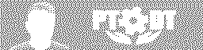
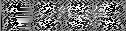

# BMP to xbpp Array Converter

Program do konwersji plików BMP na różne formaty tablic zawierających bajty obrazka w formacie 4bpp (4 bits per pixel) lub 1bpp (1 bit per pixel).

## Cel projektu

Program umożliwia konwersję obrazów BMP na dane w dwóch formatach:
- **4bpp (4 bits per pixel)** - dla wyświetlaczy LCD z paletą 16 odcieni (każdy bajt zawiera 2 piksele)
- **1bpp (1 bit per pixel)** - dla wyświetlaczy monochromatycznych (każdy bajt zawiera 8 pikseli)

Program obsługuje różne algorytmy ditheringu dla trybu 1bpp, aby uzyskać najlepszą jakość wizualną przy konwersji do czarno-białego. Dodatkowo oferuje zaawansowane opcje regulacji obrazu: jasność i kontrast, które pozwalają na precyzyjne dostrojenie wyglądu konwersji.

### Przykłady konwersji

**Obraz wejściowy (BMP):**


**Rezultat 4bpp na wyświetlaczu LCD (16 odcieni żółtego):**


**Rezultaty 1bpp z różnymi algorytmami ditheringu:**

**Brak ditheringu (progowanie) - domyślne:**

*Proste progowanie - piksele powyżej 50% jasności stają się białe, poniżej - czarne.*

**Floyd-Steinberg dithering:**

*Algorytm rozprasza błędy kwantyzacji na sąsiednie piksele, tworząc naturalny efekt ditheringu.*

**Ordered 8x8 dithering:**

*Używa matrycy Bayer 8x8 do tworzenia regularnego wzoru ditheringu, optymalnego dla wyświetlaczy.*

### Regulacja jasności i kontrastu

Program oferuje zaawansowane opcje regulacji obrazu dla trybu 1bpp:

#### Parametry regulacji:
- **Jasność (`-br`, `--brightness`)**: 0-100% (domyślnie 50%)
  - 0% = maksymalnie ciemny obraz
  - 50% = oryginalna jasność
  - 100% = maksymalnie jasny obraz

- **Kontrast (`-ct`, `--contrast`)**: 0-100% (domyślnie 50%)
  - 0% = brak kontrastu (szary)
  - 50% = oryginalny kontrast
  - 100% = maksymalny kontrast

#### Przykłady regulacji jasności (kontrast stały 80%):

**Jasność 10%:**

*Bardzo ciemny obraz - większość szczegółów zanika*

**Jasność 50%:**

*Średnia jasność - zachowuje większość szczegółów*

**Jasność 100%:**

*Maksymalnie jasny obraz - może powodować przepalenie jasnych obszarów*

#### Przykłady regulacji kontrastu (jasność stała 50%):

**Kontrast 10%:**

*Bardzo niski kontrast - obraz wygląda "płasko"*

**Kontrast 50%:**

*Średni kontrast - naturalny wygląd*

**Kontrast 80%:**

*Wysoki kontrast - wyostrzone krawędzie i szczegóły*

#### Przykłady kombinacji jasności i kontrastu:

**Jasność 70%, Kontrast 100%:**

*Jasny obraz z maksymalnym kontrastem - idealny do wyświetlaczy o niskiej jakości*

**Jasność 60%, Kontrast 70%:**

*Zbalansowane ustawienia - dobre dla większości zastosowań*

### Jak osiągnąć te rezultaty

1. **Konwersja 4bpp (domyślna)** - zobacz sekcję [Użycie](#użycie):
   ```bash
   ./bmp_to_xbpp img/sample-image.bmp
   ```

2. **Konwersja 1bpp bez ditheringu (domyślne)** - zobacz sekcję [Tryb 1bpp](#tryb-1bpp):
   ```bash
   ./bmp_to_xbpp -1 img/sample-image.bmp
   ```

3. **Konwersja 1bpp z Floyd-Steinberg dithering**:
   ```bash
   ./bmp_to_xbpp -1 -d floyd img/sample-image.bmp
   ```

4. **Konwersja 1bpp z Ordered dithering**:
   ```bash
   ./bmp_to_xbpp -1 -d o8x8 img/sample-image.bmp
   ```

5. **Konwersja 1bpp z regulacją jasności i kontrastu**:
   ```bash
   # Jasność 70%, Kontrast 100%
   ./bmp_to_xbpp -1 -d floyd -br 70 -ct 100 --bmp img/sample-image.bmp output/br70_ct100
   
   # Jasność 60%, Kontrast 70%
   ./bmp_to_xbpp -1 -d floyd -br 60 -ct 70 --bmp img/sample-image.bmp output/br60_ct70
   ```

## Opis

Program konwertuje obrazy BMP na różne formaty wyjściowe:

### Tryb 4bpp (domyślny)
- Każdy bajt zawiera 2 piksele w formacie 4bpp
- Obraz jest automatycznie konwertowany do skali szarości i skalowany do 16 odcieni (0-15)
- Idealny dla wyświetlaczy LCD z paletą kolorów

### Tryb 1bpp
- Każdy bajt zawiera 8 pikseli w formacie 1bpp (czarno-biały)
- Obraz jest konwertowany do skali szarości, a następnie dithering jest stosowany
- Idealny dla wyświetlaczy monochromatycznych (OLED, e-paper, LCD monochromatyczne)

## Kompilacja

### Linux/macOS (Makefile)
```bash
make
```

### Windows (Visual Studio)
Otwórz `bmp_to_4bpp.sln` w Visual Studio i zbuduj projekt (Ctrl+Shift+B).

Dostępne konfiguracje:
- Debug/Release dla x86 i x64
- Platform Toolset: v142 (Visual Studio 2019)

## Użycie

```bash
./bmp_to_xbpp [OPTIONS] input.bmp [output_file]
```

### Argumenty:
- `input.bmp` - plik wejściowy BMP (24-bit lub 32-bit)
- `output_file` - opcjonalny plik wyjściowy (domyślnie: image_data.h)

### Opcje główne:
- `-4, --4bpp` - Użyj 4 bits per pixel (domyślnie)
- `-1, --1bpp` - Użyj 1 bit per pixel (czarno-biały)

### Opcje skanowania:
- `-h, --horizontal` - Skanuj poziomo (wierszami) (domyślnie)
- `-v, --vertical` - Skanuj pionowo (kolumnami)
- `-l, --little-endian` - Kolejność pikseli little endian (domyślnie)
- `-b, --big-endian` - Kolejność pikseli big endian

### Opcje formatów wyjściowych:
- `-c, --c-array` - Format tablicy C (.h) (domyślnie)
- `-r, --raw-data` - Format surowych danych (.hex)
- `-a, --assembler` - Format assemblera (.inc)
- `-aa, --assembler-array` - Format MASM z makrem .array (.inc)
- `-p, --progmem` - Dodaj słowo kluczowe PROGMEM do tablic C
- `-n, --name NAME` - Ustaw nazwę tablicy (domyślnie: image_data)

### Opcje ditheringu (tylko dla 1bpp):
- `-d, --dither METHOD` - Metoda ditheringu
  - `none` - Brak ditheringu (proste progowanie) (domyślnie dla 1bpp)
  - `floyd` - Floyd-Steinberg dithering
  - `o8x8` - Ordered 8x8 dithering

### Opcje regulacji obrazu (tylko dla 1bpp):
- `-br, --brightness PERC` - Jasność 0-100% (domyślnie 50%)
- `-ct, --contrast PERC` - Kontrast 0-100% (domyślnie 50%)
- `--bmp` - Generuj BMP preview

### Inne opcje:
- `--help` - Pokaż pomoc

## Tryb 1bpp

Tryb 1bpp konwertuje obrazy do formatu monochromatycznego (czarno-biały), gdzie każdy bajt zawiera 8 pikseli. Program oferuje trzy algorytmy ditheringu:

### Algorytmy ditheringu

#### 1. Brak ditheringu (progowanie) - domyślny
- **Opis**: Proste progowanie - piksele >50% jasności = białe, ≤50% = czarne
- **Zalety**: Najszybsze, zachowuje ostre krawędzie
- **Wady**: Utrata szczegółów w półtonach
- **Użycie**: `./bmp_to_xbpp -1 image.bmp` (domyślne)

#### 2. Floyd-Steinberg dithering
- **Opis**: Rozprasza błędy kwantyzacji na sąsiednie piksele
- **Zalety**: Naturalny wygląd, dobra jakość dla fotografii
- **Wady**: Może tworzyć artefakty przy ostrych krawędziach
- **Użycie**: `./bmp_to_xbpp -1 -d floyd image.bmp`

#### 3. Ordered 8x8 dithering
- **Opis**: Używa matrycy Bayer 8x8 do tworzenia regularnego wzoru
- **Zalety**: Przewidywalny wzór, optymalny dla wyświetlaczy
- **Wady**: Może być widoczny regularny wzór
- **Użycie**: `./bmp_to_xbpp -1 -d o8x8 image.bmp`

### Regulacja jasności i kontrastu

Program oferuje zaawansowaną kontrolę nad konwersją 1bpp poprzez parametry jasności i kontrastu:

#### Jasność (0-100%)
- **0%**: Bardzo ciemny obraz (prawie wszystkie piksele czarne)
- **25%**: Ciemny obraz
- **50%**: Neutralna jasność (domyślna)
- **75%**: Jasny obraz
- **100%**: Bardzo jasny obraz (prawie wszystkie piksele białe)

#### Kontrast (0-100%)
- **0%**: Brak kontrastu (wszystkie piksele w środku skali)
- **25%**: Niski kontrast
- **50%**: Normalny kontrast (domyślny)
- **75%**: Wysoki kontrast
- **100%**: Maksymalny kontrast (tylko czarne i białe piksele)

#### Przykłady użycia:
```bash
# Ciemny obraz z niskim kontrastem
./bmp_to_xbpp -1 -br 25 -ct 25 image.bmp

# Jasny obraz z wysokim kontrastem
./bmp_to_xbpp -1 -br 75 -ct 75 image.bmp

# Ekstremalne wartości
./bmp_to_xbpp -1 -br 0 -ct 100 image.bmp  # Bardzo ciemny, maksymalny kontrast
./bmp_to_xbpp -1 -br 100 -ct 0 image.bmp  # Bardzo jasny, brak kontrastu

# Generowanie BMP preview do wizualizacji
./bmp_to_xbpp -1 -br 25 -ct 75 -d floyd --bmp image.bmp preview
```

#### Przykłady graficzne z różnymi ustawieniami:

**Jasność (kontrast 50%, Floyd-Steinberg):**
- `sample-image-br0-ct50-floyd.bmp` - 0% jasności (bardzo ciemny)
- `sample-image-br15-ct50-floyd.bmp` - 15% jasności (ciemny)
- `sample-image-br25-ct50-floyd.bmp` - 25% jasności (ciemny)
- `sample-image-br50-ct50-floyd.bmp` - 50% jasności (neutralny)
- `sample-image-br75-ct50-floyd.bmp` - 75% jasności (jasny)

**Kontrast (jasność 50%, Floyd-Steinberg):**
- `sample-image-br50-ct0-floyd.bmp` - 0% kontrastu (brak kontrastu)
- `sample-image-br50-ct50-floyd.bmp` - 50% kontrastu (normalny)
- `sample-image-br50-ct100-floyd.bmp` - 100% kontrastu (maksymalny)

### Endianness w trybie 1bpp

W trybie 1bpp kolejność bitów w bajcie ma znaczenie:
- **Little endian** (`-l`): bit 0 = pierwszy piksel (lewy)
- **Big endian** (`-b`): bit 7 = pierwszy piksel (lewy)

## Formaty wyjściowe

### 1. Tablica C (.h) - domyślny
Pełna tablica C z deklaracją:

**Format 4bpp:**
```c
// Generated by BMP to xbpp Array Converter v1.0 2025-09-28 (c) PTODT 20250929T2205
// Image size: 256x64
// Format: 4bpp
const unsigned char image_data[8192] = {
    0xFF, 0xFF, 0xFF, 0xFF, 0xFF, 0xFF, 0xFF, 0xFF, ...
};
```

**Format 1bpp bez ditheringu (domyślne):**
```c
// Generated by BMP to xbpp Array Converter v1.0 2025-09-28 (c) PTODT 20250929T2206
// Image size: 256x64
// Format: 1bpp (dithering: None)
const unsigned char image_data[2048] = {
    0x00, 0x00, 0x00, 0x00, 0x00, 0x00, 0x00, 0x00, ...
};
```

Z PROGMEM:
```c
const unsigned char image_data[8192] PROGMEM = {
    0xFF, 0xFF, 0xFF, 0xFF, 0xFF, 0xFF, 0xFF, 0xFF, ...
};
```

### 2. Surowe dane (.hex)
Tylko dane bez deklaracji:
```
FF FF FF FF FF FF FF FF FF FF FF FF FF FF FE DE
DD DD DD DD CF FF FF FF FF FF FF FF FF FF FF FF
...
```

### 3. Format assemblera (.inc)
Format dla assemblera:

**Format 4bpp:**
```
; Generated by BMP to xbpp Array Converter v1.0 2025-09-28 (c) PTODT 20250929T2205
; Image size: 256x64
; Format: 4bpp
image_data:
    .db 0xFF, 0xFF, 0xFF, 0xFF, 0xFF, 0xFF, 0xFF, 0xFF
    .db 0xFF, 0xFF, 0xFF, 0xFF, 0xFF, 0xFF, 0xFE, 0xDE
    ...
```

**Format 1bpp bez ditheringu (domyślne):**
```
; Generated by BMP to xbpp Array Converter v1.0 2025-09-28 (c) PTODT 20250929T2207
; Image size: 256x64
; Format: 1bpp (dithering: None)
image_data:
    .db $00, $00, $00, $00, $00, $00, $00, $00
    .db $00, $00, $00, $00, $00, $00, $00, $00
    ...
```

### 4. Format MASM z makrem .array (.inc)
Format dla MASM assemblera z makrem .array:

**Format 4bpp:**
```
; Generated by BMP to xbpp Array Converter v1.0 2025-09-28 (c) PTODT 20250929T2205
; Image size: 256x64
; Format: 4bpp
.array image_data[8192].byte
 $FF, $FF, $FF, $FF, $FF, $FF, $FF, $FF, $FF, $FF, $FF, $FF, $FF, $FF, $FE, $DE
$FF, $FF, $FF, $FF, $FF, $FF, $FF, $FF, $FF, $FF, $FF, $FF, $FF, $FF, $FE, $DE
...
.enda
```

**Format 1bpp bez ditheringu:**
```
; Generated by BMP to xbpp Array Converter v1.0 2025-09-28 (c) PTODT 20250929T2208
; Image size: 256x64
; Format: 1bpp (dithering: None)
.array image_data[2048].byte
 $00, $00, $00, $00, $00, $00, $00, $00, $00, $00, $00, $00, $00, $00, $00, $00
$00, $00, $00, $00, $00, $00, $00, $00, $00, $00, $00, $00, $00, $00, $00, $00
...
.enda
```

## Przykłady

### Tryb 4bpp (domyślny)

```bash
# Domyślne ustawienia (tablica C, poziomo, little endian)
./bmp_to_xbpp test.bmp image_data.h

# Format surowych danych
./bmp_to_xbpp -r test.bmp data.hex

# Format assemblera
./bmp_to_xbpp -a test.bmp sprite.inc

# Format MASM z makrem .array
./bmp_to_xbpp -aa -n image_data test.bmp sprite.inc

# Tablica C z PROGMEM
./bmp_to_xbpp -p test.bmp progmem_data.h

# Skanowanie pionowe z big endian
./bmp_to_xbpp -v -b test.bmp vertical_big.h

# Niestandardowa nazwa tablicy
./bmp_to_xbpp -n my_sprite test.bmp sprite.h
```

### Tryb 1bpp

```bash
# 1bpp bez ditheringu (domyślny)
./bmp_to_xbpp -1 test.bmp monochrome.h

# 1bpp z Floyd-Steinberg dithering
./bmp_to_xbpp -1 -d floyd test.bmp floyd.h

# 1bpp z Ordered dithering
./bmp_to_xbpp -1 -d o8x8 test.bmp ordered.h

# 1bpp z regulacją jasności i kontrastu
./bmp_to_xbpp -1 -br 25 -ct 75 test.bmp dark_high_contrast.h

# 1bpp z jasnym obrazem i niskim kontrastem
./bmp_to_xbpp -1 -br 75 -ct 25 test.bmp bright_low_contrast.h

# 1bpp z generowaniem BMP preview
./bmp_to_xbpp -1 -br 25 -ct 75 -d floyd --bmp test.bmp dark_high_contrast

# 4bpp z generowaniem BMP preview
./bmp_to_xbpp -4 --bmp test.bmp grayscale_preview

# 1bpp z big endian
./bmp_to_xbpp -1 -b test.bmp big_endian.h

# 1bpp w formacie assemblera
./bmp_to_xbpp -1 -a test.bmp monochrome.inc

# 1bpp z niestandardową nazwą
./bmp_to_xbpp -1 -n my_icon test.bmp icon.h
```

### Kombinacje opcji

```bash
# Kombinacja opcji 4bpp
./bmp_to_xbpp -v -b -a -n sprite_data test.bmp sprite.inc

# Kombinacja opcji 1bpp
./bmp_to_xbpp -1 -d o8x8 -v -b test.bmp vertical_ordered.h

# Format MASM z niestandardową nazwą
./bmp_to_xbpp -aa -n MY_SPRITE test.bmp sprite.inc

# Pokaż pomoc
./bmp_to_xbpp --help
```

## Struktura plików

### Pliki źródłowe
- `bmp_to_xbpp.c` - główny plik źródłowy (logika główna)
- `bmp_reader.c` / `bmp_reader.h` - obsługa plików BMP
- `utils.c` / `utils.h` - funkcje pomocnicze (konwersja, pakowanie, zapis)
- `options.c` / `options.h` - obsługa argumentów wiersza poleceń
- `defs.h` - definicje typów i stałych

### Pliki kompilacji
- `Makefile` - dla Linux/macOS
- `bmp_to_xbpp.sln` - plik rozwiązania Visual Studio
- `bmp_to_xbpp.vcxproj` - plik projektu Visual Studio
- `bmp_to_xbpp.vcxproj.filters` - filtry plików w Solution Explorer
- `bmp_to_xbpp.vcxproj.user` - ustawienia użytkownika

### Dokumentacja
- `readme.md` - ten plik

## Rozmiary danych

### Tryb 4bpp
- **Rozmiar**: `(szerokość × wysokość) ÷ 2` bajtów
- **Przykład**: Obraz 256×64 pikseli = 8192 bajty
- **Zawartość**: 2 piksele na bajt (4 bity każdy)

### Tryb 1bpp
- **Rozmiar**: `(szerokość × wysokość) ÷ 8` bajtów
- **Przykład**: Obraz 256×64 pikseli = 2048 bajtów
- **Zawartość**: 8 pikseli na bajt (1 bit każdy)

## Wymagania

- **Linux/macOS**: Kompilator C99 (gcc)
- **Windows**: Visual Studio 2019 lub nowszy
- Obsługa plików BMP 24-bit i 32-bit

## Licencja

MIT - zobacz nagłówki plików źródłowych dla szczegółów.

## Lista zmian

### v1.0.2 (30/09/2025) - Rozszerzenie o regulację jasności i kontrastu
- **Nowe funkcje:**
  - dodano regulację jasności (`-br`, `--brightness`) 0-100% dla trybu 1bpp
  - dodano regulację kontrastu (`-ct`, `--contrast`) 0-100% dla trybu 1bpp
  - dodano opcję `--bmp` do generowania BMP preview dla obu trybów (1bpp i 4bpp)
  - rozszerzono komentarze w plikach wynikowych o informacje o jasności i kontrastu
  - dodano skrypty Shell i BAT do generowania serii obrazów z różnymi ustawieniami

- **Ulepszenia:**
  - naprawiono kolejność pikseli w trybie poziomym dla 1bpp
  - rozszerzono dokumentację o szczegółowe opisy regulacji obrazu
  - dodano przykłady obrazów pokazujące efekty różnych ustawień jasności i kontrastu
  - dodano sekcję ze skryptami do automatycznego generowania serii testowych

- **Zachowana kompatybilność:**
  - wszystkie istniejące opcje CLI działają bez zmian
  - opcje regulacji obrazu są ignorowane dla trybu 4bpp (z wyjątkiem `--bmp`)

### v1.0.1 (29/09/2025) - Rozszerzenie o obsługę 1bpp i dithering
- **Nowe funkcje:**
  - dodano obsługę trybu 1bpp (1 bit per pixel) dla wyświetlaczy monochromatycznych
  - zaimplementowano trzy algorytmy ditheringu:
    - Floyd-Steinberg dithering (domyślny dla 1bpp)
    - ordered 8x8 dithering (matryca Bayer)
    - brak ditheringu (proste progowanie)
  - dodano nowe opcje CLI: `-1/--1bpp`, `-d/--dither METHOD`
  - rozszerzono komentarze w plikach wynikowych o informacje o trybie i metodzie ditheringu

- **Ulepszenia:**
  - rozszerzono dokumentację o szczegółowe opisy algorytmów ditheringu
  - dodano przykłady obrazów pokazujące różnice między metodami ditheringu

- **Zachowana kompatybilność:**
  - tryb 4bpp pozostaje domyślnym i działa identycznie jak wcześniej
  - wszystkie istniejące opcje CLI działają bez zmian
  - opcje ditheringu są ignorowane dla trybu 4bpp

### v1.0.0 (28/09/2025) - Pierwsza wersja projektu
- **Funkcje podstawowe:**
  - konwersja obrazów BMP (24-bit, 32-bit) do formatu 4bpp
  - obsługa różnych formatów wyjściowych: C array, raw data, assembler, MASM
  - opcje skanowania: poziome/pionowe, little/big endian
  - wsparcie dla PROGMEM w tablicach C
  - niestandardowe nazwy tablic wyjściowych

- **Formaty wyjściowe:**
  - tablica C (.h) z opcjonalnym PROGMEM
  - surowe dane (.hex)
  - format assemblera (.inc)
  - format MASM z makrem .array (.inc)

- **Platformy:**
  - Linux/macOS (Makefile + gcc)
  - Windows (Visual Studio 2019+)

## Skrypty do generowania serii obrazów

Projekt zawiera gotowe skrypty do automatycznego generowania serii obrazów BMP z różnymi kombinacjami jasności i kontrastu.

### Dostępne skrypty

- **`scripts/generate_brightness_contrast_series.sh`** - skrypt dla Linux/macOS
- **`scripts/generate_brightness_contrast_series.bat`** - skrypt dla Windows

### Funkcjonalność

Skrypty generują wszystkie kombinacje jasności i kontrastu (0-100% co 10%), tworząc 121 plików BMP z różnymi ustawieniami. Każdy plik jest nazywany według wzoru `br{jasność}_ct{kontrast}.bmp`.

### Użycie

**Linux/macOS:**
```bash
chmod +x scripts/generate_brightness_contrast_series.sh
./scripts/generate_brightness_contrast_series.sh
```

**Windows:**
```cmd
scripts\generate_brightness_contrast_series.bat
```

### Konfiguracja

W obu skryptach można łatwo zmienić:
- **Katalog wyjściowy:** zmienna `OUTPUT_DIR` (domyślnie `preview`)
- **Zakres wartości:** edytuj pętle w skrypcie (domyślnie 0-100% co 10%)

### Rezultat

Skrypty tworzą katalog `preview/` (lub inny, jeśli zmieniono `OUTPUT_DIR`) z plikami:
- `br0_ct0.bmp` - jasność 0%, kontrast 0%
- `br10_ct20.bmp` - jasność 10%, kontrast 20%
- `br50_ct50.bmp` - jasność 50%, kontrast 50% (domyślne)
- `br100_ct100.bmp` - jasność 100%, kontrast 100%
- itd.

Skrypty automatycznie liczą i wyświetlają rzeczywistą liczbę wygenerowanych plików.

## Autor

Michal Kolodziejski (2:480/112.10)  
Copyright (c) PTODT <https://ptodt.org.pl>